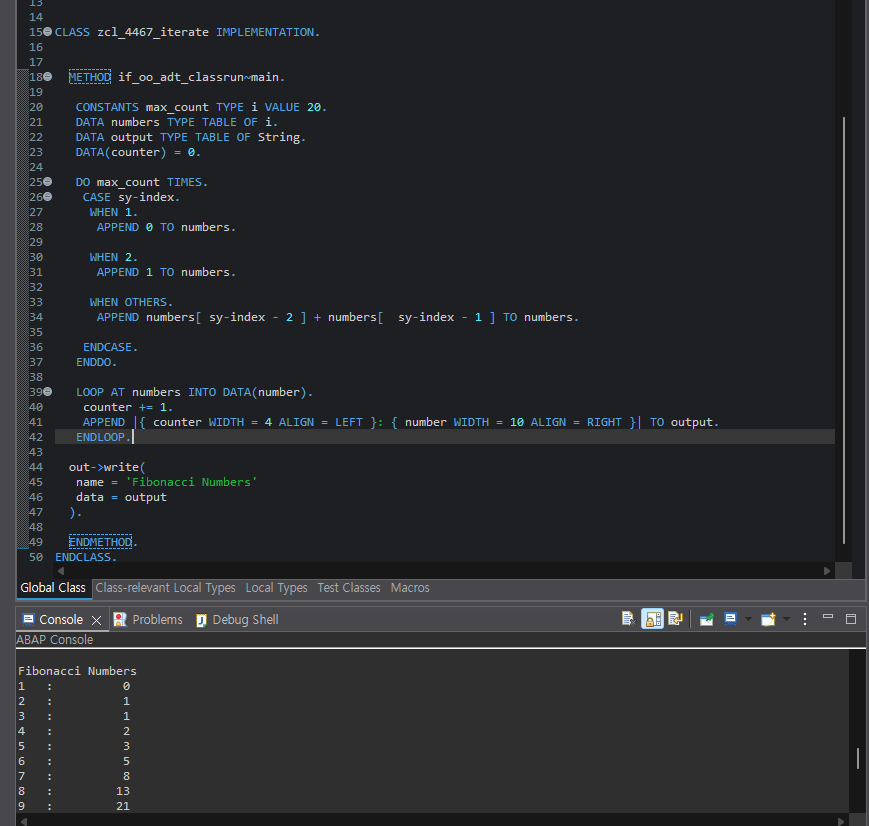

# Exercise 6: Work with Simple Internal Tables

## 목적
- 반복문과 simple internal table을 사용해 Fibonacci 수열을 계산하고 형식을 맞춰 출력한다.

## 한 일
- `ZCL_4467_ITERATE` class를 생성하고 `IF_OO_ADT_CLASSRUN`을 구현했다.
- `numbers TYPE TABLE OF i`에 Fibonacci 수열을 저장했다.
- `CASE sy-index`로 첫 두 항 `0`, `1`을 처리하고 이후 값은 이전 두 항의 합으로 계산했다.
- `output TYPE TABLE OF string`에 순번과 값을 형식화한 문자열을 저장했다.
- `out->write( name = ... data = ... )`로 caption과 함께 Console에 출력했다.

## 핵심 코드

```abap
DO max_count TIMES.
  CASE sy-index.
    WHEN 1.
      APPEND 0 TO numbers.
    WHEN 2.
      APPEND 1 TO numbers.
    WHEN OTHERS.
      APPEND numbers[ sy-index - 2 ] + numbers[ sy-index - 1 ] TO numbers.
  ENDCASE.
ENDDO.

LOOP AT numbers INTO DATA(number).
  counter += 1.
  APPEND |{ counter WIDTH = 4 ALIGN = LEFT }: { number WIDTH = 10 ALIGN = RIGHT }| TO output.
ENDLOOP.
```

## 막힌 점과 해결
- 문제: 구조체 행 타입으로 `numbers`를 선언했을 때 정수 `0`, `1`을 바로 `APPEND`할 수 없었다.
- 원인: 구조체 행 전체와 단일 정수 값의 타입이 맞지 않았다.
- 해결: 이번 실습에서는 값이 정수 하나뿐이므로 `numbers TYPE TABLE OF i`로 단순화했다.

- 문제: 출력 순번이 `0`부터 시작했다.
- 원인: `counter`를 문자열에 넣은 뒤 증가시키고 있었다.
- 해결: `counter += 1.`을 `APPEND`보다 먼저 실행해 첫 출력이 `1`부터 시작하도록 바꿨다.

- 문제: `out->write( output )`만 사용하면 교재의 importing parameter 이름 지정 요구를 충족하지 못했다.
- 해결: `out->write( name = 'Fibonacci Numbers' data = output )` 형태로 명시했다.

## 실행 결과

최종 Console 출력과 caption을 확인한 화면이다.



## 한 줄 정리
- 계산용 internal table과 출력용 internal table을 분리하면 로직과 표현을 깔끔하게 다룰 수 있다.
