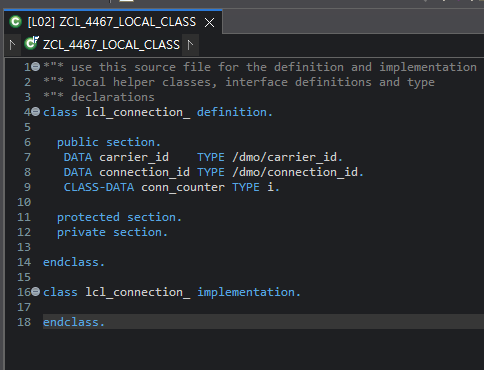

# Exercise 8: Define a Local Class

## 목적
- global class 안에서 local class를 정의하고 instance attribute와 static attribute를 구분한다.

## 한 일
- `ZCL_4467_LOCAL_CLASS`를 생성했다.
- `Local Types` 탭에서 `lcl_connection` local class를 정의했다.
- `carrier_id`, `connection_id`를 instance attribute로 선언했다.
- `conn_counter`를 `CLASS-DATA`로 선언해 static attribute로 두었다.
- 빈 `IMPLEMENTATION` 블록까지 포함해 Activate했다.

## 핵심 코드

```abap
CLASS lcl_connection DEFINITION.
  PUBLIC SECTION.
    DATA carrier_id    TYPE /dmo/carrier_id.
    DATA connection_id TYPE /dmo/connection_id.
    CLASS-DATA conn_counter TYPE i.

  PROTECTED SECTION.
  PRIVATE SECTION.
ENDCLASS.

CLASS lcl_connection IMPLEMENTATION.
ENDCLASS.
```

## 막힌 점과 해결
- 문제: local class를 어디에 두고 어떤 뼈대까지 필요한지 헷갈렸다.
- 원인: `lcl` code completion이 만드는 skeleton과 교재 요구사항의 차이를 아직 익히는 중이었다.
- 해결: `Local Types` 탭에서 skeleton을 만들고, `create private`는 제거한 뒤 `DEFINITION`과 빈 `IMPLEMENTATION`을 함께 두는 형태로 맞췄다.

## 이해한 점
- ABAP의 local class는 Java에서 method 안에 잠깐 정의하는 local class와 느낌이 다르다.
- ABAP에서는 `METHOD ... ENDMETHOD` 안에 넣는 지역 클래스가 아니라, global class 소스 안의 `Local Types`에 두는 보조 class에 가깝다.
- 즉 스코프가 method 내부로 아주 좁게 묶이는 구조라기보다, 해당 global class 파일 안에서만 함께 쓰는 helper class처럼 이해하는 편이 자연스럽다.

## 실행 결과

Local Types 탭에서 `lcl_connection` 정의와 Activate 상태를 확인한 화면이다.



## 한 줄 정리
- local class는 `Local Types`에 두고, 이번 단계에서는 실행 코드보다 class 정의 뼈대를 정확히 만드는 것이 핵심이다.
