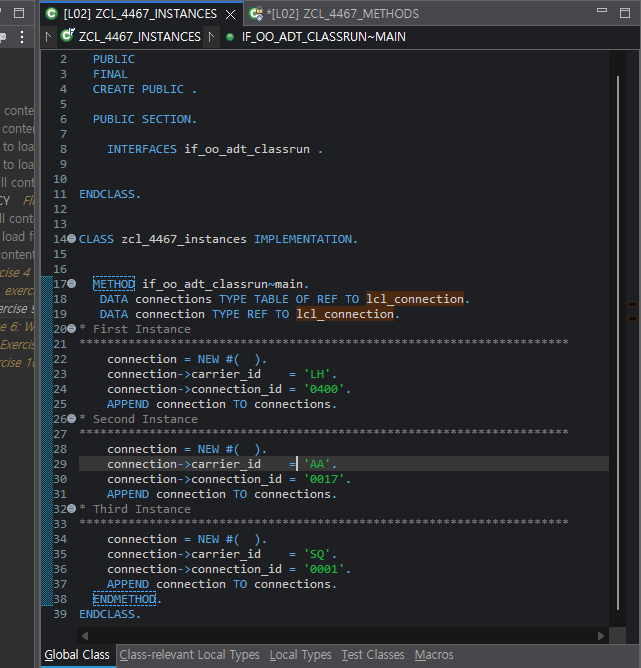

# Exercise 9: Create and Manage Instances

## 목적
- local class의 instance를 생성하고 reference variable과 reference internal table로 여러 객체를 관리한다.

## 한 일
- `connection TYPE REF TO lcl_connection`을 선언했다.
- `connections TYPE TABLE OF REF TO lcl_connection`을 선언했다.
- `NEW #( )`로 `lcl_connection` instance를 3개 생성했다.
- 각 instance에 서로 다른 `carrier_id`, `connection_id`를 넣었다.
- 매번 `APPEND connection TO connections`로 객체 참조를 internal table에 저장했다.

## 핵심 코드

```abap
DATA connections TYPE TABLE OF REF TO lcl_connection.
DATA connection TYPE REF TO lcl_connection.

connection = NEW #( ).
connection->carrier_id    = 'LH'.
connection->connection_id = '0400'.
APPEND connection TO connections.

connection = NEW #( ).
connection->carrier_id    = 'AA'.
connection->connection_id = '0017'.
APPEND connection TO connections.

connection = NEW #( ).
connection->carrier_id    = 'SQ'.
connection->connection_id = '0001'.
APPEND connection TO connections.
```

## 막힌 점과 해결
- 문제: `connections`를 선언하지 않고 다음 Exercise의 loop 구조를 먼저 보다가 흐름이 꼬였다.
- 원인: Exercise 9의 Task 3이 객체 여러 개를 모으는 단계라는 점을 놓쳤다.
- 해결: `connections TYPE TABLE OF REF TO lcl_connection`을 먼저 선언하고, `connection` 하나를 재사용하면서 새 객체를 만들 때마다 `APPEND connection TO connections`를 수행하는 구조로 다시 정리했다.

- 문제: 같은 `connection` 변수를 재사용하면 이전 객체가 덮어써질 것처럼 느껴졌다.
- 원인: reference variable과 실제 object instance를 분리해서 아직 완전히 익히지 못했다.
- 해결: `APPEND connection TO connections`는 그 시점의 객체 참조를 저장하고, 이후 `connection = NEW #( )`는 새 객체를 가리키게 할 뿐 이전 객체 참조를 지우지 않는다는 점을 이해했다.

## 실행 결과

세 개의 서로 다른 instance를 생성하고 `connections`에 추가한 최종 코드 상태를 확인한 화면이다.



## 한 줄 정리
- reference variable 하나를 재사용해도, 매번 새로 생성한 객체의 참조를 internal table에 추가하면 여러 instance를 별도로 관리할 수 있다.
