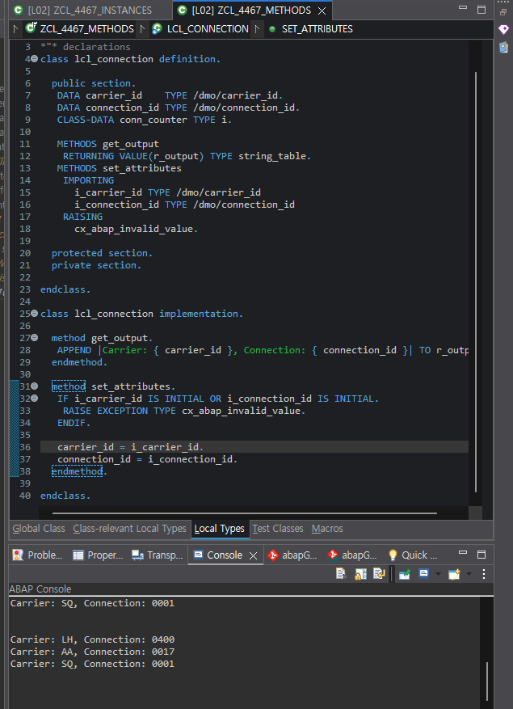
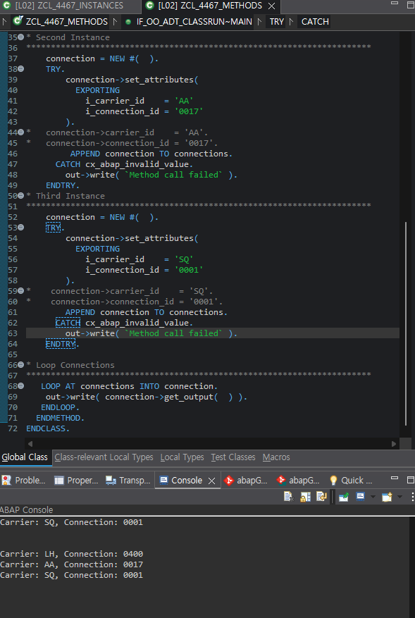

# Exercise 10: Define and Call Methods

## 목적
- local class에 method를 정의하고 구현한 뒤, attribute 직접 접근 대신 method 호출로 상태를 설정하고 출력한다.

## 한 일
- `lcl_connection`에 `get_output`과 `set_attributes` method를 선언했다.
- `get_output`이 `STRING_TABLE`을 반환하는 functional method가 되도록 구성했다.
- `set_attributes`에서 입력값이 비어 있으면 `CX_ABAP_INVALID_VALUE` exception을 발생시키도록 구현했다.
- `main`에서 `set_attributes( )`를 `TRY ... CATCH`로 감싸고 성공한 경우에만 `connections`에 추가했다.
- `LOOP AT connections INTO connection.` 안에서 `connection->get_output( )`을 직접 `out->write( )`에 전달해 출력했다.

## 핵심 코드

```abap
METHOD get_output.
  APPEND |Carrier: { carrier_id }, Connection: { connection_id }| TO r_output.
ENDMETHOD.

METHOD set_attributes.
  IF i_carrier_id IS INITIAL OR i_connection_id IS INITIAL.
    RAISE EXCEPTION TYPE cx_abap_invalid_value.
  ENDIF.

  carrier_id    = i_carrier_id.
  connection_id = i_connection_id.
ENDMETHOD.
```

```abap
TRY.
    connection->set_attributes(
      EXPORTING
        i_carrier_id    = 'LH'
        i_connection_id = '0400'
    ).
    APPEND connection TO connections.
  CATCH cx_abap_invalid_value.
    out->write( `Method call failed` ).
ENDTRY.

LOOP AT connections INTO connection.
  out->write( connection->get_output( ) ).
ENDLOOP.
```

## 막힌 점과 해결
- 문제: `connections`를 선언하지 않은 상태에서 Exercise 10의 loop 구조를 먼저 보면서 흐름이 꼬였다.
- 원인: Exercise 9의 여러 instance 관리와 Exercise 10의 method 호출 흐름이 머릿속에서 섞였다.
- 해결: `connections TYPE TABLE OF REF TO lcl_connection`과 `connection TYPE REF TO lcl_connection` 역할을 다시 분리해서 정리했다.

- 문제: `get_output`을 어떻게 호출해야 하는지 애매했다.
- 원인: 반환값이 있는 functional method와 일반 method 호출 문법이 아직 섞여 있었다.
- 해결: `connection->get_output( )`이 반환하는 `STRING_TABLE`을 `out->write( )`에 바로 넣는 구조로 이해했다.

- 문제: `set_attributes` 호출 실패 시 언제 `APPEND`해야 하는지 헷갈렸다.
- 원인: 예외가 발생한 객체도 그대로 추가될 수 있는 위치에 `APPEND`를 둘 위험이 있었다.
- 해결: `TRY` 안에서 method 호출이 성공한 다음에만 `APPEND connection TO connections`를 실행하도록 배치했다.

## 이해한 점
- `RETURNING VALUE(...)`가 있는 method는 functional method처럼 표현식 위치에서 바로 사용할 수 있다.
- `NEW #( )`의 괄호는 constructor 호출 자리이며, 지금은 전달할 인자가 없어서 비어 있다.
- direct attribute access보다 setter method를 통해 상태를 넣으면 validation과 예외 처리를 한곳에 모을 수 있다.

## 실행 결과

Local Types에서 method 선언과 구현을 확인했고, Console에서 각 connection의 출력 결과를 확인했다.




## 한 줄 정리
- object 상태 변경과 출력 로직을 method로 감싸면 validation, 예외 처리, 출력 형식을 객체 쪽으로 모아 더 구조적으로 다룰 수 있다.
