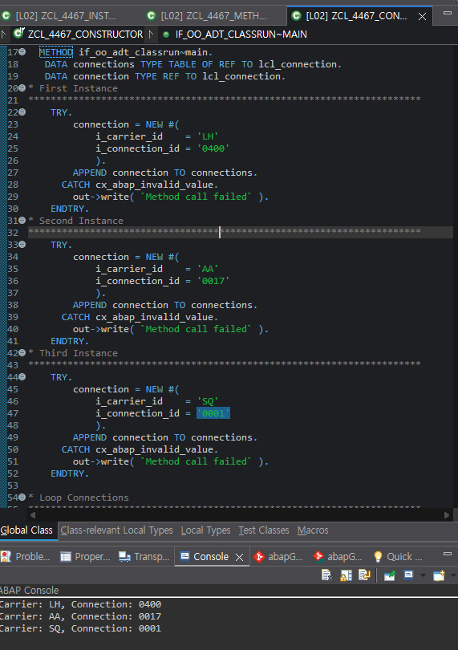
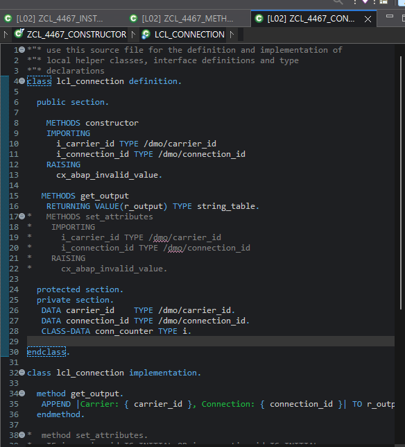
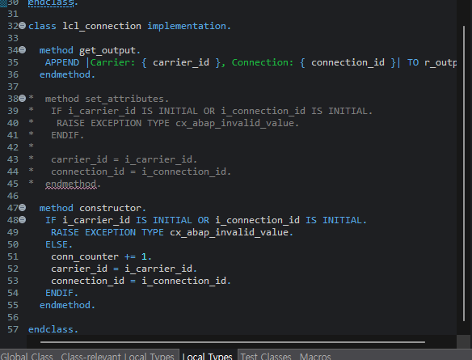

# Exercise 11: Use Private Attributes and a Constructor

## 목적
- instance attribute를 private으로 숨기고, constructor에서만 값을 받도록 바꿔 객체 생성 시점에 유효성을 강제한다.

## 한 일
- `carrier_id`, `connection_id`를 `PRIVATE SECTION`으로 옮겼다.
- `set_attributes`를 주석 처리하고 `constructor` method를 추가했다.
- constructor에 `i_carrier_id`, `i_connection_id` importing parameter와 `CX_ABAP_INVALID_VALUE` 예외를 선언했다.
- 값이 비어 있으면 exception을 발생시키고, 정상일 때만 `conn_counter`를 증가시키고 attribute를 채우도록 구현했다.
- `NEW #( ... )` 안에서 constructor parameter를 직접 넘기도록 `main`을 수정했다.
- 객체 생성 자체를 `TRY ... CATCH` 안에 두고 성공한 경우에만 `connections`에 추가했다.
- 마지막에 `get_output( )` 결과를 loop로 출력해 세 instance의 결과를 확인했다.

## 핵심 코드

```abap
METHOD constructor.
  IF i_carrier_id IS INITIAL OR i_connection_id IS INITIAL.
    RAISE EXCEPTION TYPE cx_abap_invalid_value.
  ELSE.
    conn_counter += 1.
    carrier_id    = i_carrier_id.
    connection_id = i_connection_id.
  ENDIF.
ENDMETHOD.
```

```abap
TRY.
    connection = NEW #(
      i_carrier_id    = 'LH'
      i_connection_id = '0400'
    ).
    APPEND connection TO connections.
  CATCH cx_abap_invalid_value.
    out->write( `Method call failed` ).
ENDTRY.
```

## 막힌 점과 해결
- 문제: Exercise 10의 `set_attributes( )` 흐름이 남아 있어서 constructor로 전환하는 시점이 헷갈렸다.
- 원인: 생성 후 설정 방식과 생성 시 강제 방식이 동시에 머릿속에 남아 있었다.
- 해결: `set_attributes`를 주석 처리하고, 값 전달 위치를 method call이 아니라 `NEW #( ... )` 안으로 옮겼다.

- 문제: private attribute로 바꾸면 바깥에서 더는 직접 값을 못 넣는데, 어디서 값을 설정해야 하는지 다시 정리할 필요가 있었다.
- 원인: visibility 변경과 constructor 도입이 한 번에 일어나면서 역할 분리가 동시에 바뀌었다.
- 해결: attribute 초기화 책임을 constructor 하나로 모으고, 외부에서는 `get_output( )`만 사용하도록 흐름을 단순화했다.

- 문제: `conn_counter`는 증가해야 하지만 외부에서 수정되면 안 된다.
- 해결: `CLASS-DATA conn_counter`를 `PRIVATE SECTION`에 두고 constructor 내부에서만 증가시키도록 했다.

## 이해한 점
- `NEW #( ... )`의 괄호 안은 constructor parameter를 넘기는 자리다.
- constructor에서 예외를 발생시키면, 잘못된 값으로는 객체가 완성되지 않도록 막을 수 있다.
- private attribute로 숨기면 object 상태 변경 지점을 constructor나 method 안으로 제한할 수 있어 구조가 더 단단해진다.
- `CLASS-DATA conn_counter TYPE i READ-ONLY`는 외부에서 읽기는 허용하고 수정만 막는 방식이고, `PRIVATE SECTION`에 두면 읽기와 수정 모두 막는다. 이번처럼 생성 횟수를 바깥에서도 확인할 필요가 있으면 `READ-ONLY`가 더 설명력 있는 선택이 될 수 있다.
- `me->`는 현재 instance 자신의 멤버를 명확히 가리키는 표기다. 특히 constructor나 method 안에서 parameter와 멤버변수를 구분할 때 Java의 `this.`처럼 이해하면 된다.

## 실행 결과

constructor 호출 형태, private attribute 배치, Console 출력 결과를 확인한 화면이다.





## 한 줄 정리
- 객체 생성에 꼭 필요한 값은 constructor에서 강제하고, attribute는 private으로 감춰야 object 상태를 더 안전하게 통제할 수 있다.
