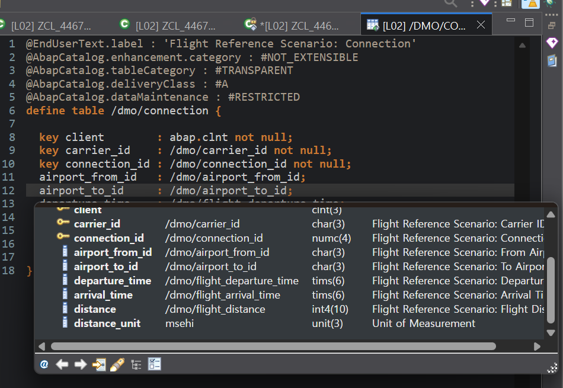
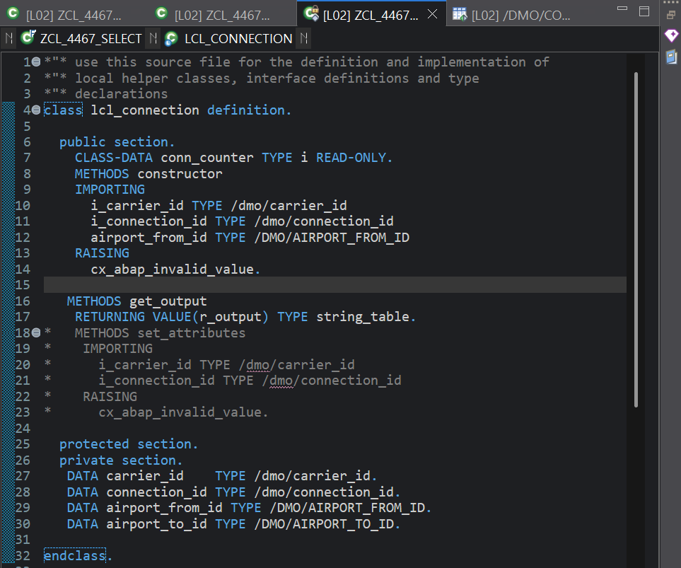
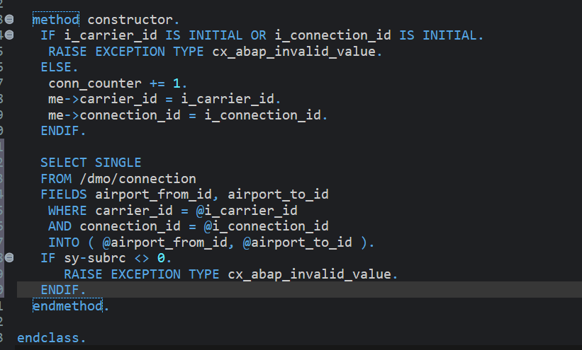

# Exercise 12: Read Data from a Database Table

## 목적
- local class에 공항 attribute를 추가하고, constructor 안에서 `/DMO/CONNECTION`을 조회해 값을 채운다.

## 한 일
- `airport_from_id`, `airport_to_id`를 `PRIVATE SECTION`에 추가했다.
- `/DMO/CONNECTION` 정의를 열어 `airport_from_id`, `airport_to_id` 필드를 확인했다.
- `get_output`에 출발 공항과 도착 공항을 출력하는 string template을 추가했다.
- constructor에서 `SELECT SINGLE`로 `/DMO/CONNECTION`을 조회해 두 공항 값을 읽었다.
- 조회 키로 `i_carrier_id`, `i_connection_id`를 사용했고 host variable에 `@`를 붙였다.
- `sy-subrc <> 0`이면 `CX_ABAP_INVALID_VALUE`를 발생시키도록 처리했다.

## 핵심 코드

```abap
SELECT SINGLE
  FROM /dmo/connection
  FIELDS airport_from_id, airport_to_id
  WHERE carrier_id    = @i_carrier_id
    AND connection_id = @i_connection_id
  INTO ( @me->airport_from_id, @me->airport_to_id ).

IF sy-subrc <> 0.
  RAISE EXCEPTION TYPE cx_abap_invalid_value.
ENDIF.
```

```abap
APPEND
  |Carrier: { carrier_id }, Connection: { connection_id }, |
  && |Airport From: { airport_from_id }, Airport To: { airport_to_id }|
  TO r_output.
```

## 막힌 점과 해결
- 문제: 긴 string template 한 줄이 너무 길어져 가독성이 떨어졌다.
- 해결: string template를 두 조각으로 나누고 `&&`로 연결했다.

- 문제: constructor에 `airport_from_id`를 importing parameter로 넣으려다 흐름이 어긋났다.
- 원인: 이번 실습의 공항 값은 외부에서 받는 값이 아니라 DB 조회 결과인데, parameter와 attribute 역할이 섞였다.
- 해결: constructor parameter는 `i_carrier_id`, `i_connection_id`만 유지하고, 공항 값은 `SELECT SINGLE` 결과를 `me->airport_from_id`, `me->airport_to_id`에 넣도록 정리했다.

- 문제: `me->`를 왜 쓰는지 감각이 애매했다.
- 해결: constructor 안에서 parameter와 멤버변수를 구분하기 위한 표기라는 점을 다시 정리했다.

## 이해한 점
- `/DMO/CONNECTION`의 key는 `client`, `carrier_id`, `connection_id`이며 Open SQL에서는 client field를 직접 WHERE에 쓰지 않아도 된다.
- constructor 안에서도 Open SQL을 사용해 객체 생성 시점에 필요한 추가 데이터를 읽어올 수 있다.
- `me->`는 현재 instance의 멤버를 가리켜 parameter와 구분할 때 특히 유용하다.

## 실행 결과

테이블 정의 확인, local class 선언, constructor의 SELECT 구현을 확인한 화면이다.





## 한 줄 정리
- 객체 생성에 필요한 기본 키는 constructor parameter로 받고, 추가 정보는 constructor 안의 `SELECT`로 읽어오면 객체가 스스로 데이터를 완성하게 만들 수 있다.
