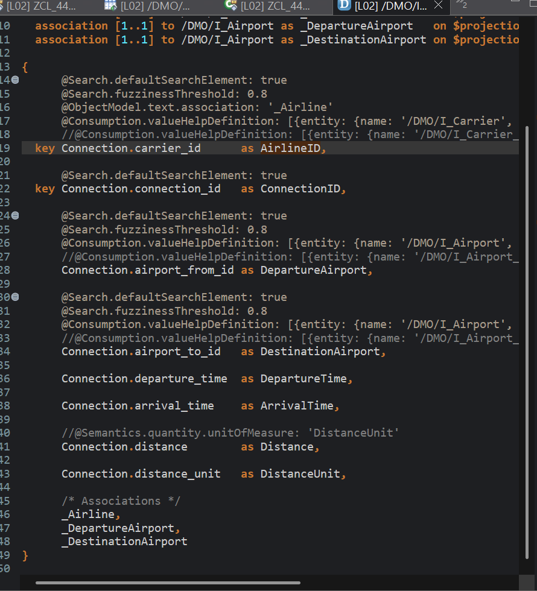
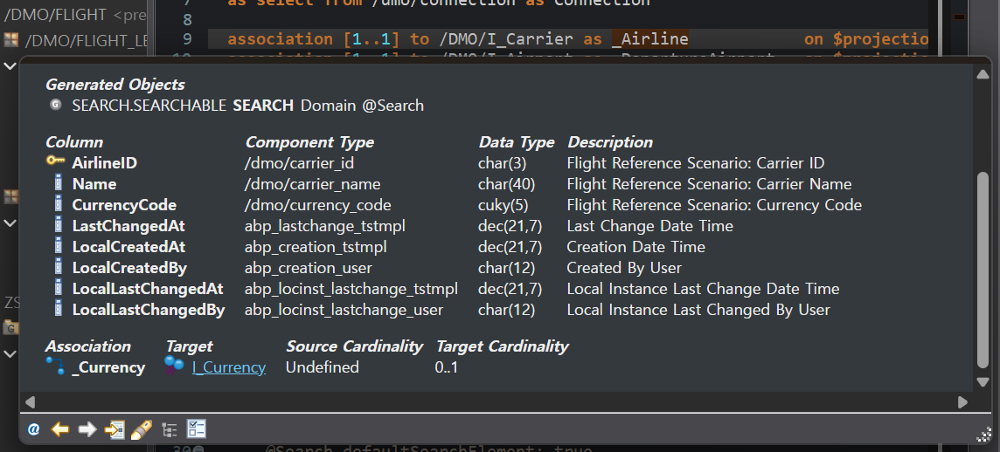
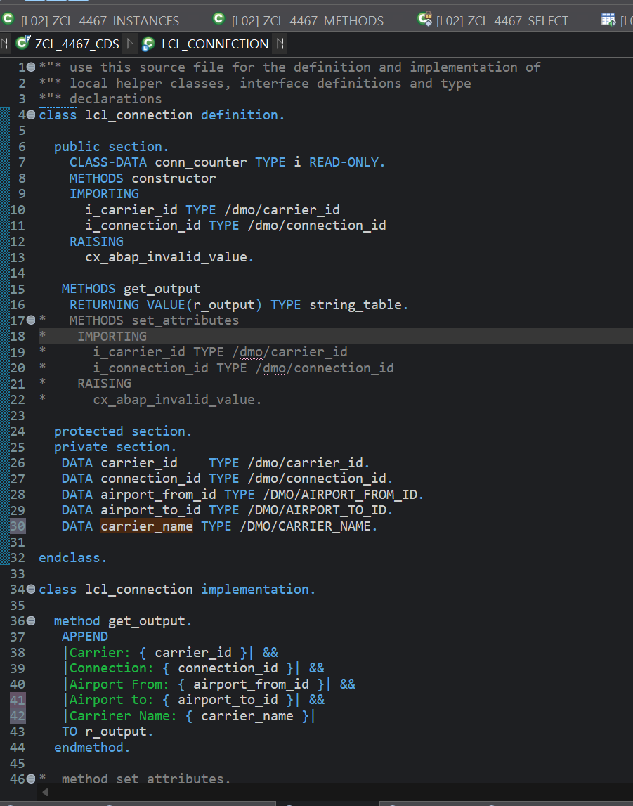
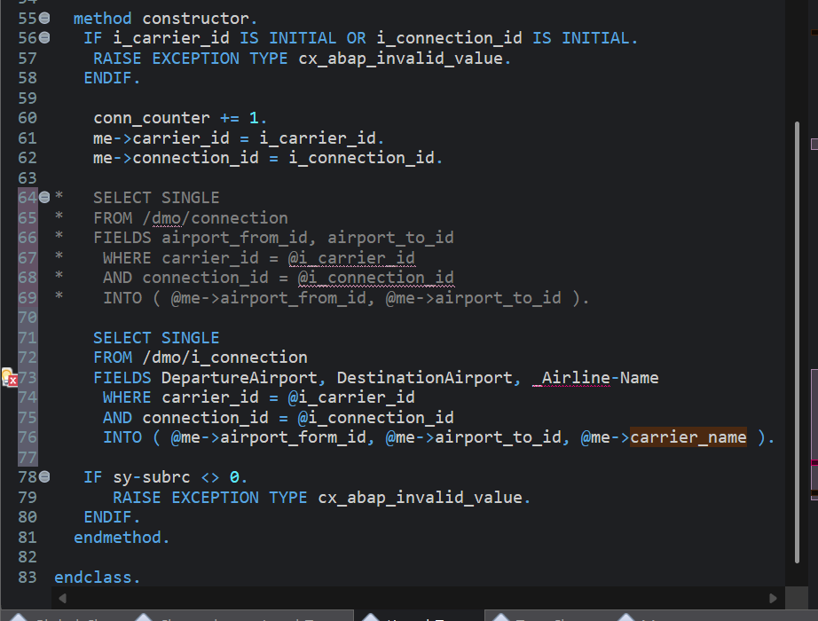
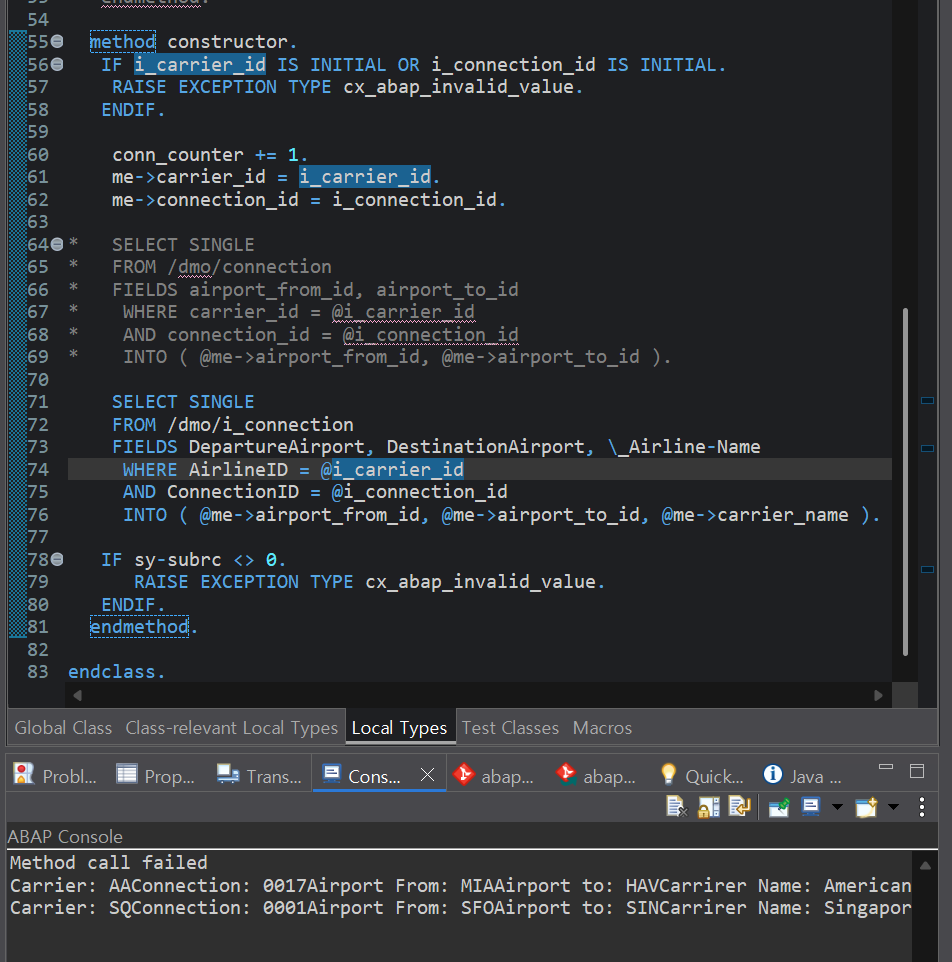

# Exercise 13: Analyze and Use a CDS View Entity

## 목적
- DB table 대신 CDS view entity `/DMO/I_Connection`을 사용해 출발 공항, 도착 공항, 항공사 이름을 함께 읽는다.

## 한 일
- `/DMO/I_Connection`의 element alias를 확인했다.
- `DepartureAirport`, `DestinationAirport`가 공항 필드의 alias임을 확인했다.
- association `_Airline`의 target에서 carrier name element를 확인했다.
- `carrier_name TYPE /DMO/CARRIER_NAME`를 `PRIVATE SECTION`에 추가했다.
- `get_output`에 `carrier_name`까지 포함되도록 출력 문자열을 확장했다.
- constructor의 기존 `/DMO/CONNECTION` 조회를 주석 처리하고 `/DMO/I_Connection` 조회로 바꿨다.
- `FIELDS DepartureAirport, DestinationAirport, _Airline-Name`를 읽도록 구현했다.
- `WHERE AirlineID = @i_carrier_id AND ConnectionID = @i_connection_id`로 key를 제한했다.
- `sy-subrc <> 0`이면 `CX_ABAP_INVALID_VALUE`를 발생시키도록 유지했다.

## 핵심 코드

```abap
SELECT SINGLE
  FROM /dmo/i_connection
  FIELDS DepartureAirport, DestinationAirport, _Airline-Name
  WHERE AirlineID    = @i_carrier_id
    AND ConnectionID = @i_connection_id
  INTO ( @me->airport_from_id, @me->airport_to_id, @me->carrier_name ).

IF sy-subrc <> 0.
  RAISE EXCEPTION TYPE cx_abap_invalid_value.
ENDIF.
```

```abap
APPEND
  |Carrier: { carrier_id }, Connection: { connection_id }, |
  && |Airport From: { airport_from_id }, Airport To: { airport_to_id }, |
  && |Carrier Name: { carrier_name }|
  TO r_output.
```

## 막힌 점과 해결
- 문제: constructor importing parameter에 공항 관련 값을 추가하려고 해서 흐름이 꼬였다.
- 원인: 이번 실습의 공항 값과 항공사 이름은 외부 입력이 아니라 CDS 조회 결과인데, parameter와 attribute 역할이 섞였다.
- 해결: constructor parameter는 `i_carrier_id`, `i_connection_id`만 유지하고, 공항과 항공사 이름은 CDS 조회 결과를 `me->` attribute에 넣도록 정리했다.

- 문제: 첫 번째 테스트 데이터에서 `Method call failed`가 발생했다.
- 원인: 선택한 key 조합이 CDS 조회 결과와 맞지 않아 `sy-subrc <> 0`가 되었을 가능성이 있었다.
- 해결: 실제 조회 가능한 key 조합으로 다시 맞춰 실행 결과를 확인했다.

- 문제: 출력 문자열이 너무 길고 항목 사이가 붙어 보여 가독성이 떨어졌다.
- 해결: string template를 `&&`로 나누고 각 항목 사이에 구분 문자열을 넣어 보기 좋게 정리했다.

## 이해한 점
- CDS view entity는 alias 이름으로 읽어야 하므로 DB table의 원래 필드명과 다를 수 있다.
- association target의 element는 `_Airline-Name`처럼 경로 형태로 `FIELDS`에 넣을 수 있다.
- CDS view entity의 key element는 `AirlineID`, `ConnectionID`처럼 노출된 alias 기준으로 `WHERE`를 작성한다.

## 실행 결과

CDS element alias 확인, local class 확장, constructor의 CDS 조회 구현과 실행 결과를 확인한 화면이다.







## 한 줄 정리
- CDS view entity를 사용하면 DB table을 직접 읽을 때보다 비즈니스 의미가 드러난 alias와 association을 통해 필요한 값을 더 편하게 가져올 수 있다.
