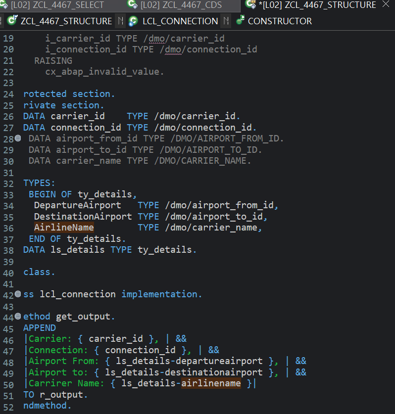
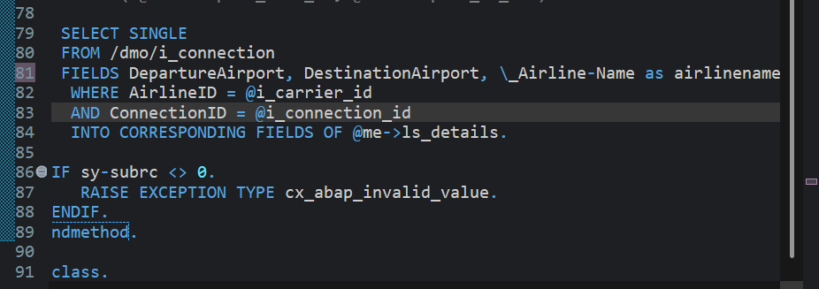

# Exercise 14: Use a Structured Data Object

## 목적
- 개별 attribute로 관리하던 공항/항공사 정보를 하나의 structured attribute로 묶고, SELECT 결과를 구조체에 채운다.

## 한 일
- `airport_from_id`, `airport_to_id`, `carrier_name` 개별 attribute를 주석 처리했다.
- `PRIVATE SECTION`에 구조체 타입 `ty_details`를 정의했다.
- `DepartureAirport`, `DestinationAirport`, `AirlineName` component를 가진 `ls_details` attribute를 선언했다.
- `get_output`에서 `ls_details-departureairport`, `ls_details-destinationairport`, `ls_details-airlinename`으로 구조체 component에 접근했다.
- constructor의 SELECT 결과를 `INTO CORRESPONDING FIELDS OF @me->ls_details`로 구조체에 한 번에 받았다.

## 핵심 코드

```abap
TYPES:
  BEGIN OF ty_details,
    DepartureAirport   TYPE /dmo/airport_from_id,
    DestinationAirport TYPE /dmo/airport_to_id,
    AirlineName        TYPE /dmo/carrier_name,
  END OF ty_details.

DATA ls_details TYPE ty_details.
```

```abap
SELECT SINGLE
  FROM /dmo/i_connection
  FIELDS DepartureAirport, DestinationAirport, \_Airline-Name AS AirlineName
  WHERE AirlineID    = @i_carrier_id
    AND ConnectionID = @i_connection_id
  INTO CORRESPONDING FIELDS OF @me->ls_details.
```

## 막힌 점과 해결
- 문제: `_Airline-Name`을 구조체 component `AirlineName`에 바로 넣기 어려웠다.
- 원인: `INTO CORRESPONDING FIELDS`는 SELECT field 이름과 구조체 component 이름을 기준으로 매핑한다.
- 해결: `\_Airline-Name AS AirlineName`으로 alias를 지정해 `ty_details-AirlineName` component와 이름을 맞췄다.

- 문제: 긴 출력 문자열에서 구조체 component 접근이 길어져 읽기 어려웠다.
- 해결: string template를 여러 줄로 나누고 `&&`로 연결했다.

## 이해한 점
- 구조체 component 접근은 `ls_details-component` 형태로 한다.
- `INTO CORRESPONDING FIELDS OF`는 이름이 같은 component에 값을 넣으므로, 필요하면 `AS`로 field alias를 맞춘다.
- CDS association path를 SELECT field로 사용할 때는 `\_Airline-Name`처럼 path expression 형태를 쓸 수 있다.

## 실행 결과

구조체 타입 선언, 구조체 component 기반 출력, SELECT 결과를 구조체로 받는 구현을 확인한 화면이다.




## 한 줄 정리
- 서로 관련된 값은 개별 attribute로 흩어두기보다 구조체로 묶고, SELECT 결과도 구조체에 바로 받으면 코드의 의미가 더 선명해진다.
