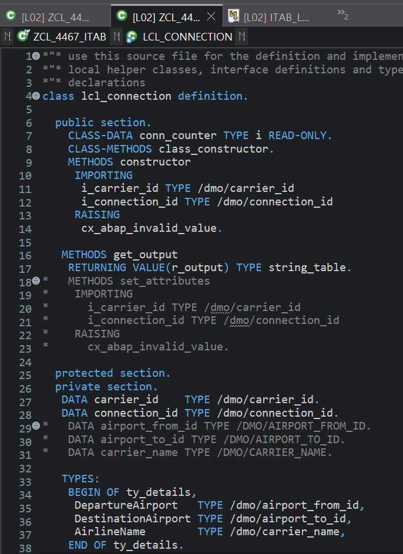
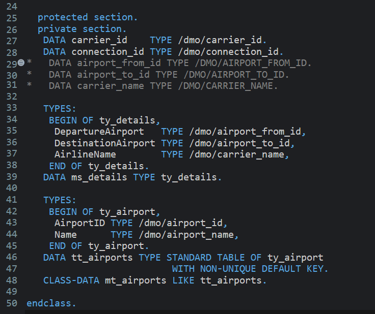
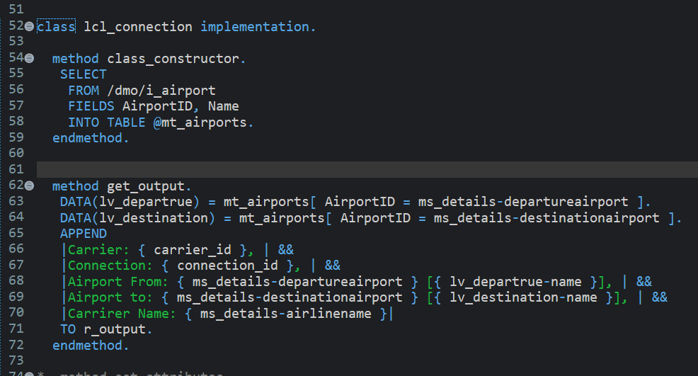

# Exercise 15: Use a Complex Internal Table

## 목적
- 모든 공항 정보를 static internal table에 한 번 읽어두고, connection 출력 시 공항 ID에 대응하는 공항 이름을 찾아 함께 출력한다.

## 한 일
- 공항 한 건을 표현하는 `ty_airport` structure type을 정의했다.
- 공항 목록을 담는 table type 성격의 `tt_airports`를 만들고 `mt_airports` static attribute를 선언했다.
- `CLASS-METHODS class_constructor`를 선언했다.
- `class_constructor`에서 `/DMO/I_Airport`의 `AirportID`, `Name`을 `mt_airports`에 읽어왔다.
- `get_output`에서 table expression으로 출발 공항과 도착 공항의 상세 정보를 찾았다.
- 출력 문자열에 공항 ID와 공항 이름을 함께 표시했다.

## 핵심 코드

```abap
TYPES:
  BEGIN OF ty_airport,
    AirportID TYPE /dmo/airport_id,
    Name      TYPE /dmo/airport_name,
  END OF ty_airport.

DATA tt_airports TYPE STANDARD TABLE OF ty_airport
  WITH NON-UNIQUE DEFAULT KEY.
CLASS-DATA mt_airports LIKE tt_airports.
```

```abap
METHOD class_constructor.
  SELECT
    FROM /dmo/i_airport
    FIELDS AirportID, Name
    INTO TABLE @mt_airports.
ENDMETHOD.
```

```abap
DATA(lv_departure) = mt_airports[ AirportID = ms_details-departureairport ].
DATA(lv_destination) = mt_airports[ AirportID = ms_details-destinationairport ].
```

## 막힌 점과 해결
- 문제: `class_constructor`가 자동 실행되지 않는 것처럼 보였다.
- 원인: `constructor` 철자가 틀려 특수한 class constructor로 인식되지 않았다.
- 해결: 선언과 구현을 모두 `CLASS-METHODS class_constructor.` / `METHOD class_constructor.`로 맞췄다.

- 문제: `mt_airports`를 왜 `CLASS-DATA`로 선언해야 하는지 헷갈렸다.
- 원인: 공항 목록이 instance별 값인지 class 공용 참조 데이터인지 구분이 필요했다.
- 해결: 모든 connection instance가 같은 공항 목록을 사용하므로 `CLASS-DATA`로 두고, class 최초 사용 시 한 번만 SELECT하도록 이해했다.

- 문제: table type을 별도로 두는 이유가 궁금했다.
- 원인: `CLASS-DATA mt_airports TYPE STANDARD TABLE OF ...`로 바로 선언해도 가능해 보였다.
- 해결: `ty_airport`, `tt_airports`, `mt_airports`로 나누면 line type, table type, 실제 static table의 역할이 분리되어 재사용과 이해가 쉬워진다는 점을 정리했다.

## 이해한 점
- 일반 `CLASS-METHODS`는 자동 실행되지 않고 직접 호출해야 한다.
- 이름이 정확히 `class_constructor`인 class constructor만 class가 처음 사용될 때 자동으로 한 번 실행된다.
- `mt_airports[ AirportID = ... ]`는 internal table에서 조건에 맞는 한 행을 읽는 table expression이다.
- 조회 대상 행이 없으면 table expression은 예외를 낼 수 있으므로, 실제 업무 코드에서는 예외 처리나 존재 확인을 고려해야 한다.

## 실행 결과

class constructor 선언, static airport table 선언, class constructor 구현과 `get_output`의 table expression 사용을 확인한 화면이다.





## 한 줄 정리
- class constructor와 static internal table을 함께 쓰면 여러 instance가 공유할 참조 데이터를 한 번만 읽어두고 재사용할 수 있다.
