# Exercise 16: Analyze a Business Object

## 목적
- RAP Business Object interface와 실제 Business Object의 CDS/behavior 구조를 따라가며, 표준 operation, action, validation, behavior implementation의 역할을 이해한다.

## 한 일
- behavior definition `/DMO/I_AGENCYTP`를 열어 interface behavior를 분석했다.
- CDS view entity `/DMO/I_AgencyTP`에서 projection 구조와 data source `/DMO/R_AgencyTP`를 확인했다.
- CDS view entity `/DMO/R_AgencyTP`에서 실제 root view entity와 data source `/DMO/I_Agency`를 확인했다.
- behavior definition `/DMO/R_AGENCYTP`에서 managed behavior, readonly/mandatory field, validation, draft action을 확인했다.
- behavior pool class `/DMO/BP_R_AGENCYTP`를 열어 global class가 비어 있고 local handler class에 실제 logic이 있음을 확인했다.
- local class `lhc_agency`의 private methods와 validation 구현을 살펴봤다.

## 핵심 관찰

### `/DMO/I_AGENCYTP` behavior interface
- `interface;`: 실제 BO 본체가 아니라 외부에 공개되는 Business Object Interface임을 나타낸다.
- `use draft;`: draft instance 처리를 지원한다.
- `extensible`: 고객/파트너 확장을 허용한다.
- entity 개수는 `define behavior for ...`가 하나뿐이므로 1개다.
- entity alias는 `/DMO/Agency`다.
- standard operation은 `create`, `update`, `delete`다.
- non-standard operation은 `use action ...` 구문에 정의된 `Resume`, `Edit`, `Activate`, `Discard`, `Prepare`다.

### `/DMO/I_AgencyTP`와 `/DMO/R_AgencyTP`
- `/DMO/I_AgencyTP`의 key element는 `AgencyID`다.
- `/DMO/I_AgencyTP`는 `@AbapCatalog.extensibility` 기준으로 extensible이다.
- `/DMO/I_AgencyTP`는 `/DMO/R_AgencyTP`를 data source로 하는 projection이다.
- `/DMO/R_AgencyTP`도 extensible이다.
- `/DMO/R_AgencyTP`의 data source는 `/DMO/I_Agency`다.
- `/DMO/R_AgencyTP`는 projection/interface가 아니라 실제 root view entity 쪽이다.

### `/DMO/R_AGENCYTP` behavior
- `managed ...;`: RAP framework가 기본 create/update/delete 처리 흐름을 관리한다.
- `implementation in class /dmo/bp_r_agencytp unique;`: behavior implementation이 `/DMO/BP_R_AGENCYTP` class에 고유하게 연결된다.
- `field ( readonly )`에 있는 `AgencyID`, 생성/변경 관련 technical fields 등은 직접 변경하면 안 된다.
- `field ( mandatory )`에 있는 `CountryCode`, `EMailAddress`, `Name`은 필수 입력값이다.
- `validation /DMO/validateName on save ...`: save 시점에 `Name` 관련 validation을 수행한다.
- `{ create; field Name; }`: create 작업에서 `Name` field가 validation 대상임을 나타낸다.

### Behavior implementation
- `/DMO/BP_R_AGENCYTP` global class definition/implementation은 비어 있다.
- 실제 behavior logic은 local handler class `lhc_agency` 안에 있다.
- `lhc_agency`의 private methods는 authorization과 validation을 담당한다.
- 확인한 validation method에는 `validatecountrycode`, `validateemailaddress`, `validatename`, `validatelargeobject`가 있다.
- `class_constructor`는 attachment mime type 허용 목록을 준비한다.

## Task 4: Analyze the Behavior Implementation

### `/DMO/BP_R_AGENCYTP` global class
- global class는 `PUBLIC ABSTRACT FINAL FOR BEHAVIOR OF /dmo/r_agencytp`로 정의되어 있다.
- definition과 implementation이 비어 있는 이유는 실제 behavior logic을 global class 본문에 직접 쓰지 않기 때문이다.
- RAP behavior pool에서는 실제 처리 로직이 local handler class에 들어간다.

### local class `lhc_agency`
- `lhc_agency`는 `cl_abap_behavior_handler`를 상속한다.
- `PRIVATE SECTION`에는 authorization과 validation method들이 정의되어 있다.
- 확인한 private method는 다음 5개다.
- `get_global_authorizations`: global authorization 처리용 method
- `validatecountrycode`: `CountryCode` validation
- `validateemailaddress`: `EMailAddress` validation
- `validatename`: `Name` validation
- `validatelargeobject`: attachment/mimetype/filename 관련 validation

### validation 구현에서 본 패턴
- `READ ENTITIES OF /dmo/r_agencytp IN LOCAL MODE`로 validation 대상 entity 값을 읽는다.
- 문제가 있는 row는 `failed-/dmo/agency`에 추가한다.
- 사용자에게 보여줄 메시지는 `reported-/dmo/agency`에 추가한다.
- `%tky`는 validation 대상 entity instance를 식별하는 technical key로 사용된다.
- `%state_area`는 어떤 validation 영역에서 생긴 메시지인지 구분한다.
- `%msg`에는 `/dmo/cx_agency` exception object를 넣어 구체적인 메시지를 만든다.
- `%element-... = if_abap_behv=>mk-on`은 어떤 field에 문제가 있는지 UI/consumer에 표시하기 위한 marker다.

### `validatelargeobject`
- attachment와 mimetype이 서로 맞는지 확인한다.
- `allowed_mimetypes` static table은 `class_constructor`에서 준비된다.
- 파일 확장자는 `substring_from`과 정규식 `\\.([^.]+)$`로 filename에서 추출한다.
- mimetype이 허용 목록에 없거나, filename extension과 mimetype이 맞지 않거나, attachment/filename 조합이 맞지 않으면 `failed`와 `reported`에 기록한다.

## 막힌 점과 해결
- 문제: `/DMO/I_AgencyTP`, `/DMO/R_AgencyTP`, `/DMO/I_Agency`의 관계가 처음에 헷갈렸다.
- 해결: `/DMO/I_AgencyTP`는 projection/interface 계층, `/DMO/R_AgencyTP`는 root view entity, `/DMO/I_Agency`는 그 data source로 구분했다.

- 문제: behavior pool의 global class가 비어 있어서 구현이 어디 있는지 헷갈렸다.
- 해결: global class는 behavior pool의 껍데기이고, 실제 handler logic은 local class `lhc_agency`에 있다는 점을 확인했다.

## 실행 결과

Business Object interface, CDS projection/root structure, behavior definition, behavior implementation을 분석한 화면이다.

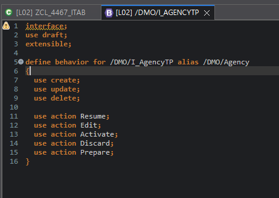
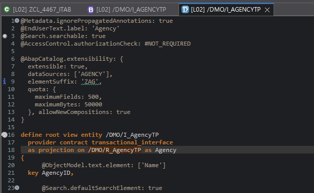
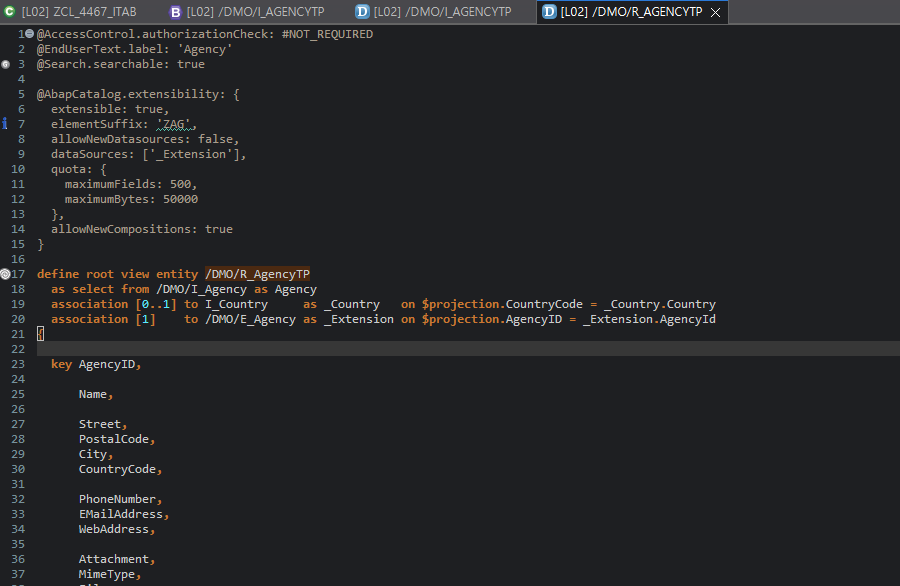
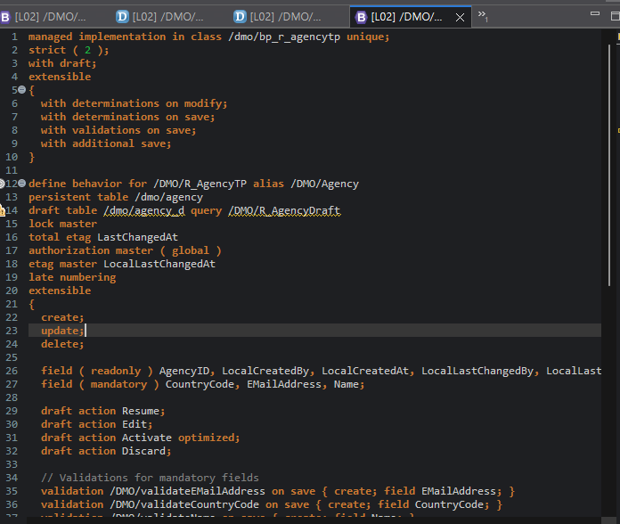

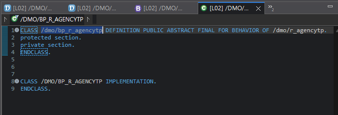
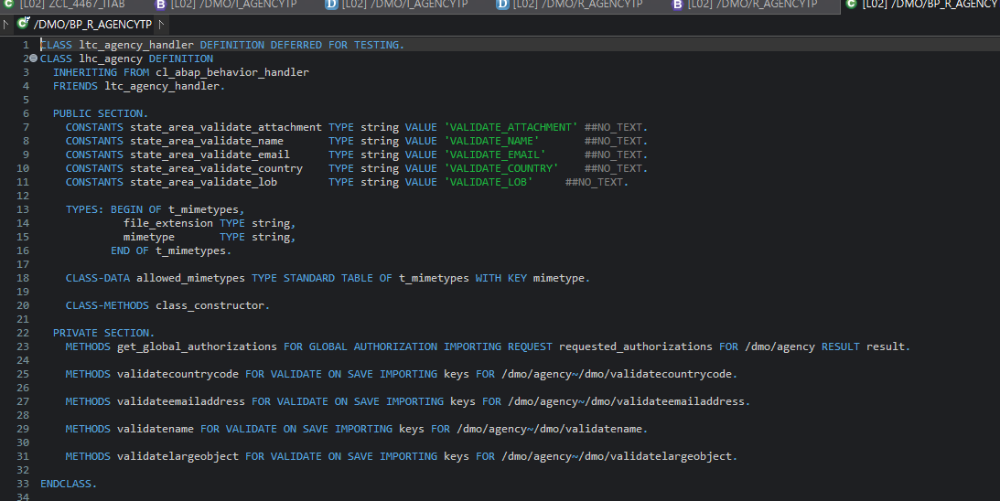
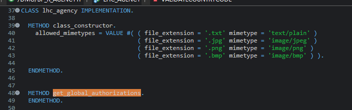
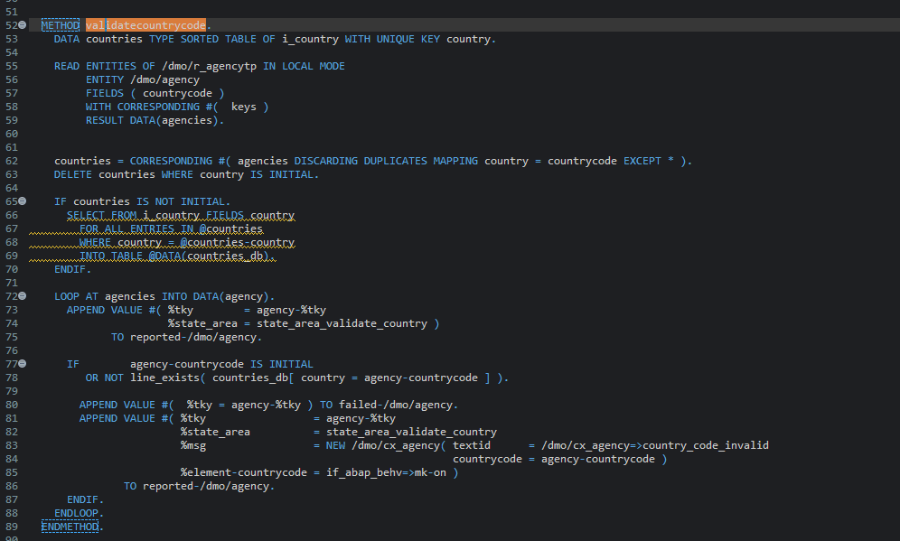
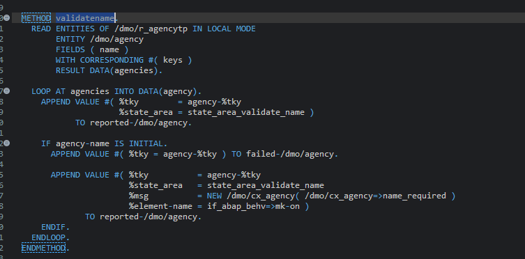
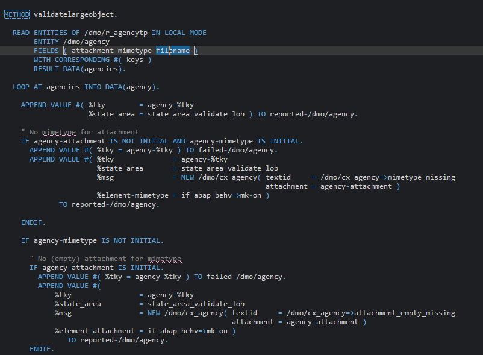
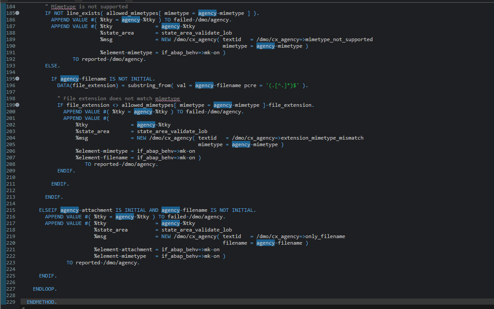

## 한 줄 정리
- RAP Business Object는 interface/projection/root/behavior implementation이 층으로 나뉘며, 실제 validation과 action logic은 behavior pool의 local handler class에서 찾는다.
