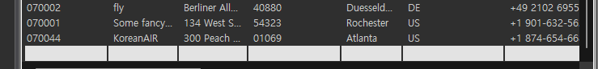
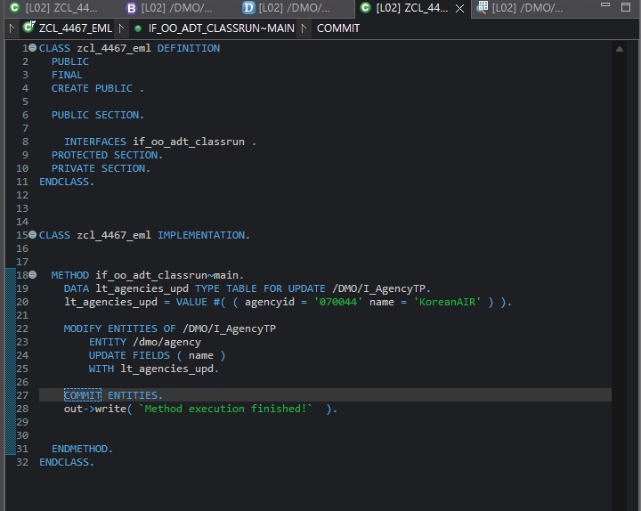

# Exercise 17: Modify Data Using EML

## 목적
- EML을 사용해 RAP Business Object Interface `/DMO/I_AgencyTP`의 root entity 데이터를 update한다.

## 한 일
- Data Preview에서 수정 대상 agency를 확인했다.
- 실습 대상 `AgencyID`는 `070044`로 사용했다.
- `ZCL_4467_EML` class를 생성하고 `IF_OO_ADT_CLASSRUN`을 구현했다.
- `TYPE TABLE FOR UPDATE /dmo/i_agencytp`로 EML update용 internal table을 선언했다.
- `VALUE #( ... )`로 update할 agency 한 줄을 구성했다.
- `MODIFY ENTITIES OF /dmo/i_agencytp`로 Business Object Interface의 behavior 계층에 update 요청을 보냈다.
- `UPDATE FIELDS ( name )`로 `Name`만 수정 대상으로 지정했다.
- `COMMIT ENTITIES`를 추가해 변경을 확정했다.
- Data Preview에서 `Name = KoreanAIR`로 변경된 것을 확인했다.

## 핵심 코드

```abap
DATA lt_agencies_upd TYPE TABLE FOR UPDATE /dmo/i_agencytp.

lt_agencies_upd = VALUE #(
  ( agencyid = '070044' name = 'KoreanAIR' )
).

MODIFY ENTITIES OF /dmo/i_agencytp
  ENTITY /dmo/agency
  UPDATE FIELDS ( name )
  WITH lt_agencies_upd.

COMMIT ENTITIES.
```

## 막힌 점과 해결
- 문제: 교재의 `700##` 규칙과 실제 Data Preview의 값이 맞지 않았다.
- 해결: 실제 존재하는 `AgencyID = 070044`를 대상으로 사용했다.

- 문제: `VALUE #( ( agencyid = '070044' name = 'KoreanAIR' ) )` 구문이 처음에 낯설었다.
- 해결: update용 internal table에 한 행을 생성해 넣는 constructor expression으로 이해했다.

- 문제: `MODIFY ENTITIES OF /DMO/I_AgencyTP`가 data definition 계층을 직접 수정하는 것인지 behavior 계층에 요청하는 것인지 헷갈렸다.
- 해결: 문법에는 CDS view entity 이름을 쓰지만, 실제로는 해당 entity에 연결된 Business Object Interface의 behavior 계층에 update 요청을 보내는 EML 구문으로 정리했다.

## 이해한 점
- `MODIFY ENTITIES OF`는 RAP Business Object behavior 계층에 create/update/delete/action 같은 변경 요청을 보낼 때 사용한다.
- 조회는 `READ ENTITIES OF`, 변경/액션 요청은 `MODIFY ENTITIES OF`, 저장 확정은 `COMMIT ENTITIES`로 나눠 이해할 수 있다.
- `ENTITY /dmo/agency`는 behavior definition의 alias를 사용한 것이다.
- `UPDATE FIELDS ( name )`는 key로 전달된 row에서 실제 수정할 field를 `name`으로 제한한다.
- `MODIFY ENTITIES`만 실행하면 변경이 확정되지 않으므로 `COMMIT ENTITIES`가 필요하다.

## 실행 결과

Data Preview에서 대상 agency와 변경 결과를 확인했고, `ZCL_4467_EML`에서 EML update와 commit을 실행했다.




## 한 줄 정리
- EML의 `MODIFY ENTITIES`는 DB table을 직접 수정하는 것이 아니라 RAP Business Object behavior에 변경 요청을 보내는 구문이다.
