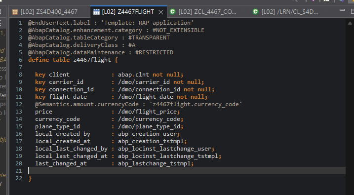
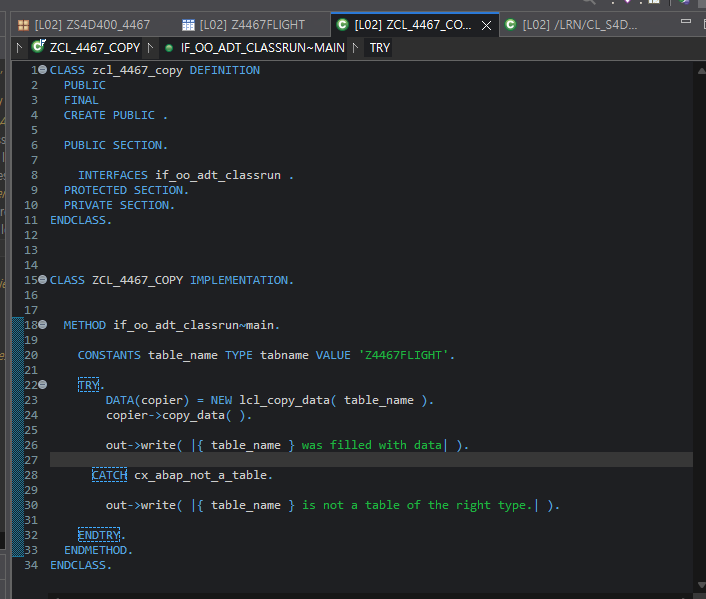
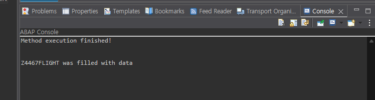
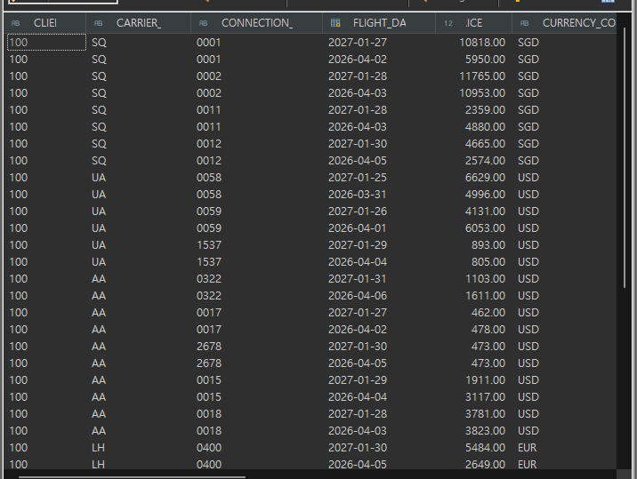

# Exercise 18: Copy a Database Table

## 목적
- OData UI Service 실습을 위한 RAP 전용 package를 만들고, template database table을 복사한 뒤 데이터를 채운다.

## 한 일
- `ZS4D400_4467_RAP` subpackage를 생성했다.
- template database table `/LRN/S4D400_APT`를 복사해 `Z4467FLIGHT` table을 만들었다.
- `Z4467FLIGHT` database table definition을 Activate했다.
- `/LRN/CL_S4D400_APT_COPY`를 복사해 `ZCL_4467_COPY` class를 만들었다.
- `table_name` constant를 `Z4467FLIGHT`로 변경했다.
- `ZCL_4467_COPY`를 Console app으로 실행해 `Z4467FLIGHT`에 데이터를 채웠다.
- Data Preview에서 `Z4467FLIGHT` 데이터가 들어간 것을 확인했다.

## 핵심 코드

```abap
CONSTANTS table_name TYPE tabname VALUE 'Z4467FLIGHT'.

TRY.
    DATA(copier) = NEW lcl_copy_data( table_name ).
    copier->copy_data( ).

    out->write( |{ table_name } was filled with data.| ).

  CATCH cx_abap_not_a_table.
    out->write( |{ table_name } is not a table of the right type.| ).
ENDTRY.
```

## 막힌 점과 해결
- 문제: `Link with Editor`가 정상적으로 동작하지 않아 Project Explorer에서 대상 object를 찾기 어려웠다.
- 해결: `Ctrl + Shift + A`로 object를 직접 열고, 필요하면 Project Explorer나 editor의 context menu에서 복사 작업을 진행하는 방식으로 우회했다.

## 실행 결과

복사된 table definition, 데이터 채우기 class, Console 실행 결과, Data Preview를 확인한 화면이다.






## 한 줄 정리
- RAP/OData UI Service 실습용 객체는 별도 package에 모으고, template table을 복사한 뒤 전용 copy class로 데이터를 채운다.
