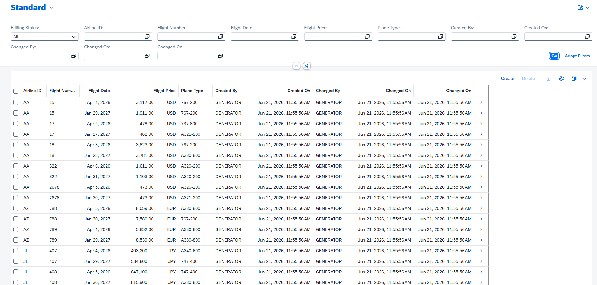
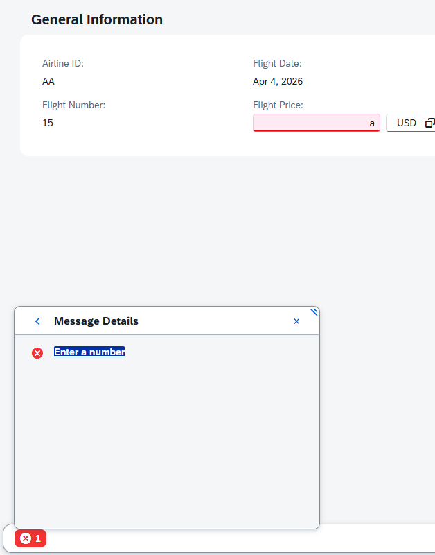
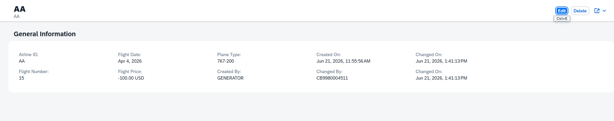

# Exercise 19: Generate and Preview an OData UI Service

## 목적
- Exercise 18에서 준비한 `Z4467FLIGHT` 테이블을 기반으로 RAP OData UI Service를 생성하고 Fiori Elements Preview에서 동작을 확인한다.

## 한 일
- `Z4467FLIGHT`를 기반으로 RAP/OData UI Service 관련 artifact를 생성했다.
- 생성된 Service Binding을 publish하고 Fiori Elements Preview를 열었다.
- List Report 화면에서 필터 바, 테이블, `Create`, `Delete`, 설정 버튼이 자동으로 구성되는 것을 확인했다.
- Object Page로 이동해 상세 데이터를 확인했다.
- `Edit` 모드에서 수정 가능한 필드와 읽기 전용 필드를 구분해 확인했다.
- `Flight Price`에 문자 값을 입력했을 때 타입 기반 오류가 발생하는 것을 확인했다.
- `Flight Price`에 음수 값 `-100.00 USD`를 입력했을 때는 저장되는 것을 확인했다.

## 확인한 화면

List Report 화면이 자동 생성되어 `Z4467FLIGHT` 데이터가 테이블로 표시되었다.

숫자 필드인 `Flight Price`에 문자 `a`를 입력하면 UI에서 `Enter a number` 오류가 발생했다.

반면 `-100.00 USD`처럼 숫자 형식은 맞지만 업무적으로 이상한 값은 저장되었다.

## 막힌 점과 해결
- 문제: `Flight Price`에 문자 입력은 막히지만 음수 금액은 저장되었다.
- 원인: 문자 입력은 metadata/type 기반 검증으로 UI에서 처리되지만, "금액은 0보다 커야 한다" 같은 업무 규칙은 아직 behavior validation으로 구현되지 않았기 때문이다.
- 해결: 이번 Exercise에서는 현상을 확인하고, 이후 Exercise에서 validation을 추가할 필요가 있음을 기록했다.

## 한 줄 정리
- OData UI Service Generator는 RAP artifact와 Fiori Elements 화면을 빠르게 만들어주지만, 업무 규칙 검증은 별도로 behavior 계층에 구현해야 한다.

