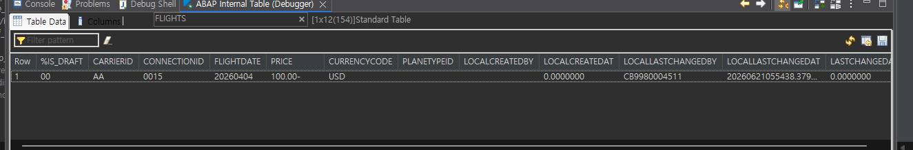
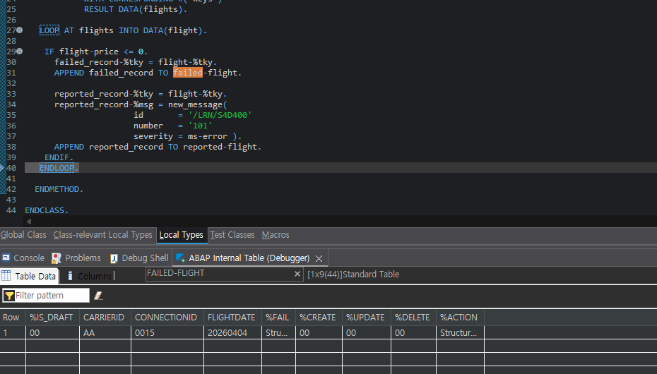
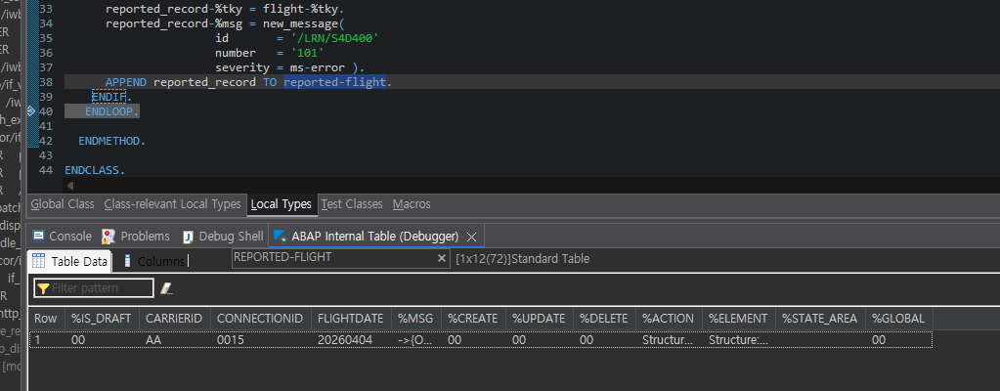
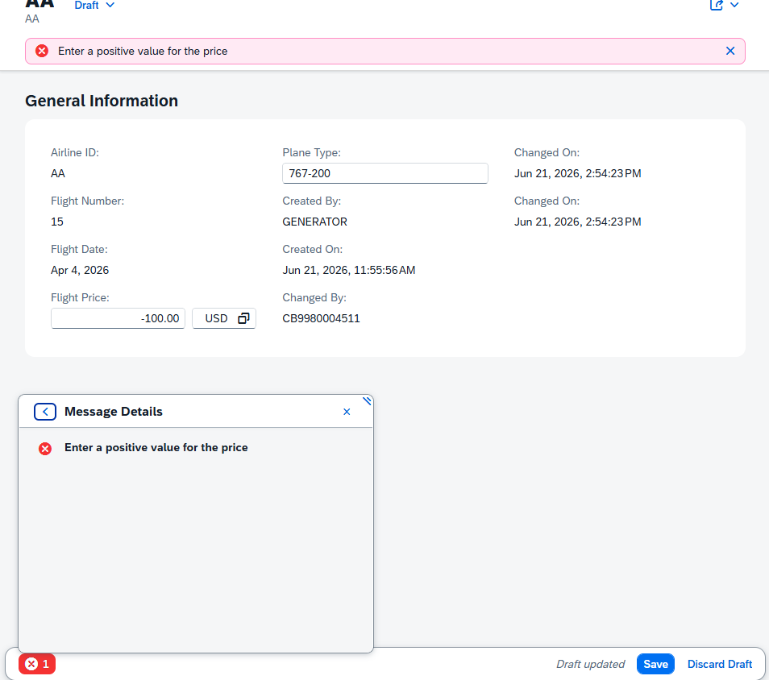

# Exercise 20: Validate the Flight Price

## 목적
- RAP Behavior Validation을 사용해 `Flight Price`가 `0` 이하일 때 저장을 막는다.
- 구 ABAP의 `MESSAGE E` 방식과 RAP의 `failed` / `reported` 패턴 차이를 이해한다.
- Debugger에서 `READ ENTITIES`, `failed-flight`, `reported-flight`가 어떻게 채워지는지 확인한다.

## 한 일
- Behavior Definition `ZR_4467FLIGHT`에 `validatePrice` validation을 추가했다.
- Validation 구현 메소드에서 `READ ENTITIES ... IN LOCAL MODE`로 transactional buffer의 현재 입력 값을 읽었다.
- `%tky`를 사용해 문제가 발생한 row를 `failed-flight`와 `reported-flight`에 연결했다.
- `reported-flight-%msg`에 message object를 넣어 Fiori UI에 오류 메시지를 전달했다.
- Debugger에서 정상 가격과 음수 가격의 처리 흐름을 비교했다.

## 핵심 코드

```abap
METHOD validatePrice.
  DATA failed_record   LIKE LINE OF failed-flight.
  DATA reported_record LIKE LINE OF reported-flight.

  READ ENTITIES OF ZR_4467FLIGHT IN LOCAL MODE
    ENTITY FLIGHT
    FIELDS ( Price )
    WITH CORRESPONDING #( keys )
    RESULT DATA(flights).

  LOOP AT flights INTO DATA(flight).
    CLEAR failed_record.
    CLEAR reported_record.

    IF flight-price <= 0.
      failed_record-%tky = flight-%tky.
      APPEND failed_record TO failed-flight.

      reported_record-%tky = flight-%tky.
      reported_record-%msg = new_message(
        id       = '/LRN/S4D400'
        number   = '101'
        severity = ms-error ).
      APPEND reported_record TO reported-flight.
    ENDIF.
  ENDLOOP.
ENDMETHOD.
```

## 디버깅으로 확인한 흐름

`READ ENTITIES ... IN LOCAL MODE` 실행 후 `flights` internal table에 현재 입력 값이 들어오는 것을 확인했다. 정상 값 `100.00`은 validation 조건을 통과한다.



음수 가격을 입력한 경우 `failed_record-%tky = flight-%tky` 후 `APPEND failed_record TO failed-flight`가 실행되면서 실패 대상 row가 `failed-flight`에 들어갔다.



같은 row에 대해 `reported_record-%msg`가 채워지고 `reported-flight`에 append되었다. 이 정보가 Fiori UI에 표시될 오류 메시지의 근거가 된다.



최종적으로 Fiori Preview에서 `Flight Price = -100.00` 저장이 막히고 `/LRN/S4D400` message class의 오류 메시지가 표시되었다.



## 이해한 내용

### `IN LOCAL MODE`

`IN LOCAL MODE`는 현재 RAP 처리 흐름의 local transactional context에서 entity 값을 읽겠다는 의미다.

Validation은 저장 직전에 실행되므로 사용자가 입력한 값이 아직 DB에 반영되지 않았을 수 있다. 이때 `SELECT`로 DB를 읽으면 이전 값이 나올 수 있지만, `READ ENTITIES ... IN LOCAL MODE`를 사용하면 현재 transactional buffer의 변경 값을 읽을 수 있다.

### `%tky`

`%tky`는 RAP의 technical key다. Draft-enabled Business Object에서는 실제 key 필드뿐 아니라 draft 처리를 위한 기술 정보까지 함께 고려해야 하므로, validation에서는 보통 개별 key를 직접 채우기보다 `%tky`를 그대로 복사한다.

```abap
failed_record-%tky = flight-%tky.
reported_record-%tky = flight-%tky.
```

이렇게 하면 RAP framework가 어떤 entity row에서 문제가 발생했는지 알 수 있다.

### `failed`와 `reported`

`failed-flight`는 저장을 실패 처리할 row를 RAP framework에 알려주는 테이블이다.

`reported-flight`는 사용자에게 보여줄 메시지를 RAP framework에 전달하는 테이블이다.

```abap
APPEND failed_record TO failed-flight.
APPEND reported_record TO reported-flight.
```

`APPEND` 자체가 즉시 메시지를 띄우는 것은 아니다. Validation 메소드가 끝난 뒤 RAP framework가 이 결과 테이블을 읽고 저장 실패와 UI 메시지를 처리한다.

## `MESSAGE E`와 RAP validation 비교

구 ABAP에서는 오류 상황에서 다음처럼 직접 메시지를 발생시키는 방식이 익숙하다.

```abap
MESSAGE e001(zmsg).
```

이 방식은 절차적 프로그램 흐름에서 즉시 오류 메시지를 발생시키고 처리를 중단하는 느낌에 가깝다.

RAP에서는 validation 메소드 안에서 직접 `MESSAGE E`를 발생시키기보다, framework가 해석할 수 있도록 `failed-*`와 `reported-*` 결과 테이블에 정보를 채운다.

| 방식 | 구 ABAP | RAP Validation |
|---|---|---|
| 오류 처리 | `MESSAGE E` 직접 발생 | `failed-*`에 실패 row 추가 |
| 메시지 전달 | 현재 프로그램 흐름에서 즉시 표시 | `reported-*`에 message object 추가 |
| 대상 row 식별 | 주로 화면/프로그램 컨텍스트에 의존 | `%tky`로 entity instance 지정 |
| 처리 주체 | ABAP 프로그램 | RAP framework |

한 줄로 정리하면:

> 구 ABAP의 `MESSAGE E`는 직접 오류를 던지는 방식이고, RAP validation은 `failed`와 `reported`에 결과를 쌓아 framework가 저장 실패와 메시지 표시를 처리하게 하는 방식이다.

## 한 줄 정리
- RAP validation에서는 문제가 있는 row를 `%tky`로 지정하고, `failed`는 저장 실패, `reported`는 UI 메시지 전달 역할을 맡는다.

