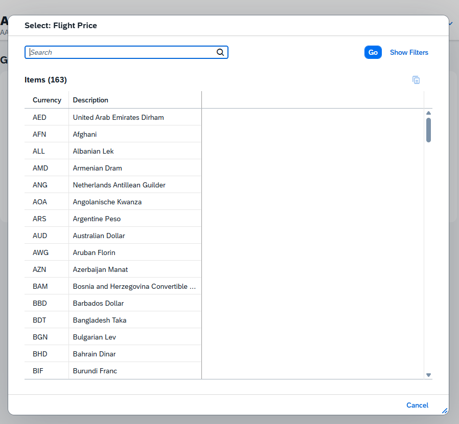
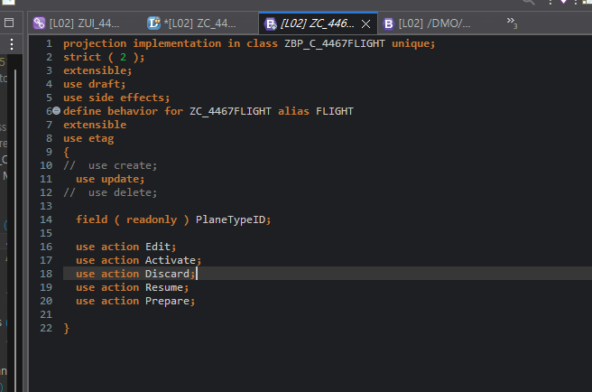
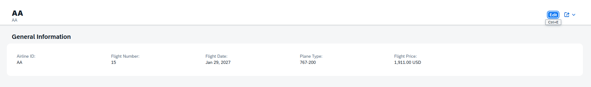
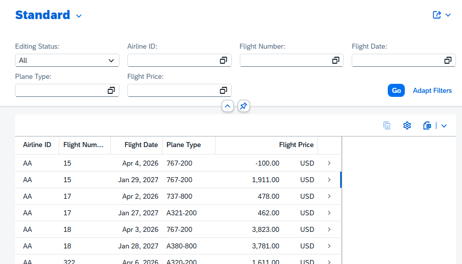

# Exercise 21: Adjust the User Interface

## 목적
- 생성된 RAP OData UI Service의 Fiori Elements 화면을 조정한다.
- Value Help가 어디서 정의되는지 확인한다.
- Behavior Projection과 Metadata Extension의 역할 차이를 이해한다.

## 한 일
- `CurrencyCode` 필드의 value help를 Fiori Preview와 CDS annotation에서 확인했다.
- Behavior Projection에서 `create`, `delete`를 비활성화하고 `PlaneTypeID`를 read-only로 설정했다.
- Metadata Extension에서 administrative fields를 숨겼다.
- Object Page에서 `Plane Type`이 `Flight Price` 앞에 오도록 field order를 조정했다.
- 최종 List Report 화면에서 업무 필드 중심으로 UI가 정리된 것을 확인했다.

## Task 1: Analyze the Value Help

Object Page에서 `Currency` 필드의 value help를 열어 통화 목록이 표시되는 것을 확인했다.



`CurrencyCode`의 value help는 CDS annotation으로 정의되어 있었다.

```abap
@Consumption.valueHelpDefinition: [ {
  entity.name: 'I_CurrencyStdVH',
  entity.element: 'Currency',
  useForValidation: true
} ]
currency_code as CurrencyCode,
```

정리:

- value help annotation: `@Consumption.valueHelpDefinition`
- value help provider: `I_CurrencyStdVH`
- 매핑 element: `Currency`
- `I_CurrencyStdVH`는 `I_Currency`를 기반으로 하는 standard value help view다.
- `I_Currency`는 `TCURC`, `TCURX`, `I_CurrencyText`를 통해 통화 코드, 소수점 자리수, 텍스트를 제공한다.

## Task 2: Adjust the Behavior

Behavior Projection에서 이 UI service에 노출할 동작을 제한했다.



적용 내용:

```abap
// use create;
use update;
// use delete;

field ( readonly ) PlaneTypeID;
```

정리:

- `create`, `delete`는 이 service projection에서만 비활성화했다.
- root Business Object 자체의 기능을 제거한 것은 아니다.
- `update`는 유지했으므로 Edit 모드는 계속 사용할 수 있다.
- `PlaneTypeID`는 이 service에서 read-only로 노출된다.

## Task 3: Adjust the UI Metadata

Metadata Extension에서 administrative fields를 숨기고 Object Page의 field order를 조정했다.



숨긴 administrative fields:

- `LocalCreatedBy`
- `LocalCreatedAt`
- `LocalLastChangedBy`
- `LocalLastChangedAt`
- `LastChangedAt`

Object Page에서 최종 순서가 다음처럼 정리되었다.

```text
Airline ID
Flight Number
Flight Date
Plane Type
Flight Price
```

특히 요구사항이었던 `Flight Date -> Plane Type -> Flight Price` 순서가 맞게 반영되었다.

## Task 4: Verify the Result

최종 List Report에서 administrative fields가 사라지고 업무 필드 중심으로 화면이 정리된 것을 확인했다.



확인 내용:

- `Create` 버튼이 사라졌다.
- `Delete` 버튼이 사라졌다.
- administrative fields 컬럼이 보이지 않는다.
- List Report가 `Airline ID`, `Flight Number`, `Flight Date`, `Plane Type`, `Flight Price` 중심으로 정리되었다.
- Object Page에서 `Plane Type`은 `Flight Price` 앞에 표시된다.
- Edit 모드에서 `Plane Type`은 read-only로 동작한다.

## 막힌 점과 해결
- 문제: 처음 Object Page에서 `Plane Type`이 `Flight Price` 뒤에 표시되었다.
- 원인: Metadata Extension의 `@UI.identification` position 조정이 요구 순서와 맞지 않았다.
- 해결: `PlaneTypeID`의 position을 `Price`보다 앞에 오도록 조정했다.

## 한 줄 정리
- Exercise 21은 Behavior Projection으로 서비스 동작을 제한하고, Metadata Extension으로 Fiori Elements UI의 필드 표시와 순서를 다듬는 실습이다.

